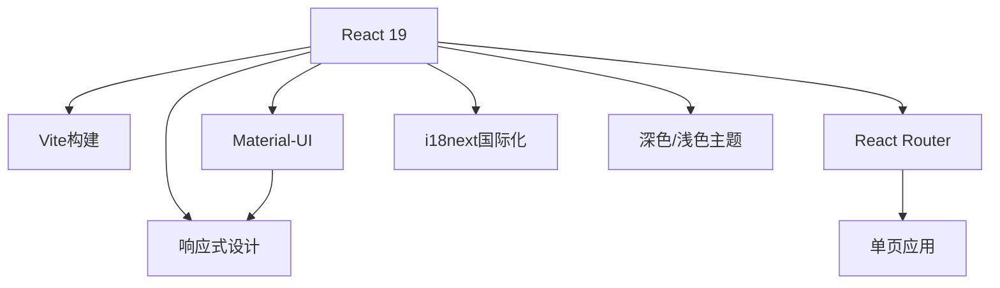
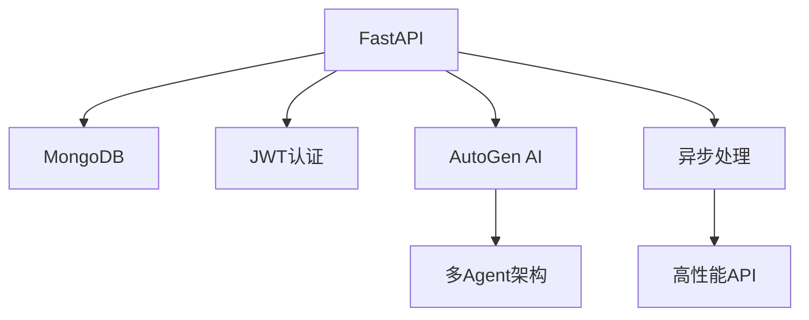

<div align="center">

# 🤖 智能代码审查系统

### AI驱动的代码质量守护者 | 让代码审查更智能、更高效

[](https://github.com/caiyusheng650/CodeReviewSystem)
[](LICENSE)
[](https://python.org)
[](https://reactjs.org)

**🚀 在线演示**: [https://code-review-system-orpin.vercel.app/](https://code-review-system-orpin.vercel.app/)

> 一个基于AI的智能代码审查系统，通过GitHub Actions集成，为开发团队提供自动化的代码质量分析和审查服务

</div>

---

## ✨ 核心特性

### 🎯 智能审查能力
| 功能模块 | 描述 | 优势 |
|---------|------|------|
| **🤖 AI驱动审查** | 多Agent架构深度代码分析 | 精准识别代码问题 |
| **🔗 GitHub集成** | 自动PR审查流程 | 无缝集成开发工作流 |
| **📊 7维质量评估** | 全方位代码质量分析 | 全面保障代码质量 |
| **🏆 信誉系统** | 开发者表现评估 | 激励代码质量提升 |
| **💬 实时助手** | 智能代码建议 | 即时问题解答 |

### 🛠️ 技术特色
- **⚡ 现代化技术栈**: FastAPI + React 19 + MongoDB
- **🌐 多语言支持**: 完整中英文国际化
- **🌓 黑暗模式**: 深色/浅色主题
- **📱 响应式设计**: Material-UI现代化界面
- **🔌 RESTful API**: 标准化API设计

## 🏗️ 系统架构

### 🎨 前端技术栈


### ⚙️ 后端技术栈


### 🔍 AI审查维度

| 维度 | 图标 | 检查内容 | 重要性 |
|------|------|----------|--------|
| **静态分析** | 📝 | 代码规范、命名约定 | ⭐⭐⭐⭐ |
| **逻辑缺陷** | 🐛 | 逻辑错误、分支覆盖 | ⭐⭐⭐⭐⭐ |
| **内存安全** | 💾 | 内存泄漏、资源管理 | ⭐⭐⭐⭐ |
| **安全漏洞** | 🔒 | 安全风险、注入攻击 | ⭐⭐⭐⭐⭐ |
| **性能优化** | ⚡ | 性能瓶颈、算法效率 | ⭐⭐⭐⭐ |
| **可维护性** | 🏗️ | 代码结构、复杂度 | ⭐⭐⭐ |
| **架构设计** | 📐 | 设计模式、模块划分 | ⭐⭐⭐⭐ |

## 🚀 快速开始

### 📋 环境要求

| 组件 | 版本要求 | 说明 |
|------|----------|------|
| **Python** | 3.10+ | 后端运行环境 |
| **Node.js** | 18+ | 前端运行环境 |
| **MongoDB** | Atlas或本地 | 数据存储 |
| **Git** | 最新版本 | 版本控制 |

### ⚡ 一键安装脚本

```bash
# 克隆项目
git clone https://github.com/caiyusheng650/CodeReviewSystem.git
cd CodeReviewSystem

# 运行安装脚本（如果提供）
# ./scripts/setup.sh
```

### 🔧 手动安装步骤

#### 1️⃣ 后端服务配置

```bash
cd backend

# 安装Python依赖
pip install -r requirements.txt

# 配置环境变量
cp .env.example .env
# 编辑.env文件，配置数据库连接和AI服务

# 启动后端服务
python main.py
```

#### 2️⃣ 前端应用配置

```bash
cd frontend

# 安装依赖
npm install

# 启动开发服务器
npm run dev
```

#### 3️⃣ 访问系统

🎯 **服务地址**:
- **前端界面**: http://localhost:5173
- **后端API**: http://localhost:8000  
- **API文档**: http://localhost:8000/docs

💡 **提示**: 确保后端服务启动后再访问前端界面

## 📋 使用指南
详细使用指南请见 http://localhost:5173/documentation
### 🔗 GitHub Actions集成

#### 1️⃣ 配置工作流文件

下载 http://localhost:8000/api/install/workflow/ai-review.yml 链接中的文件，保存为 `.github/workflows/ai-review.yml`：

#### 2️⃣ 配置GitHub Secrets
在GitHub仓库设置中添加以下secrets：

| Secret名称 | 描述 | 获取方式 |
|------------|------|----------|
| `CODE_REVIEW_API_TOKEN` | API认证令牌 | 在Web界面生成 |
| `CODE_REVIEW_API_URL` | API服务地址 | 部署后的服务地址 |

#### 3️⃣ 创建Pull Request
系统将在PR创建时自动触发AI代码审查，审查结果会显示在：
- ✅ PR对话页面
- 📝 行内评论
- 🌐 Web前端界面

### 🖥️ Web界面使用

#### 🏠 首页功能
- **智能导航**: 自动跳转到最近的审查记录
- **新手引导**: 新用户自动导航到文档页面

#### 📊 审查记录
| 功能 | 描述 | 图标 |
|------|------|------|
| **历史查看** | 查看所有代码审查记录 | 📜 |
| **智能筛选** | 按状态、仓库、作者筛选 | 🔍 |
| **导出功能** | 导出审查报告 | 📄 |

#### 🔍 审查详情
- **问题分类**: 7个维度的详细问题展示
- **代码对比**: 支持代码片段对比查看
- **智能助手**: 实时聊天获取改进建议

#### ⚙️ 设置管理
- **API密钥**: 生成和管理API密钥
- **个性化**: 界面主题和语言设置

## 🔧 API接口

### 📚 完整API文档
访问 **http://localhost:8000/docs** 查看完整的API文档，包含：

#### 🔐 认证接口
- `POST /api/auth/login` - 用户登录
- `POST /api/auth/register` - 用户注册
- `GET /api/auth/me` - 获取用户信息

#### 🔍 代码审查接口
- `POST /api/codereview/` - 提交代码审查
- `GET /api/codereview/{review_id}` - 获取审查详情
- `GET /api/codereview/` - 获取审查列表

#### 🔑 API密钥管理
- `POST /api/apikeys/` - 创建API密钥
- `GET /api/apikeys/` - 获取密钥列表
- `DELETE /api/apikeys/{key_id}` - 删除API密钥


## 🗂️ 项目结构

```
CodeReviewSystem/
├── 📁 backend/                 # 后端服务
│   ├── 📁 app/
│   │   ├── 📁 models/          # 🗄️ 数据模型
│   │   ├── 📁 routers/         # 🔌 API路由
│   │   ├── 📁 services/        # ⚙️ 业务逻辑
│   │   ├── 📁 source/          # 📦 静态资源
│   │   └── 📁 utils/           # 🛠️ 工具函数
│   ├── 🐍 main.py             # 🚀 应用入口
│   └── 📄 requirements.txt     # 📋 Python依赖
├── 📁 frontend/               # 前端应用
│   ├── 📁 src/
│   │   ├── 📁 components/     # 🧩 React组件
│   │   ├── 📁 pages/          # 📄 页面组件
│   │   ├── 📁 services/       # 🔗 API服务
│   │   ├── 📁 contexts/       # 🎯 状态管理
│   │   └── 📁 utils/          # 🛠️ 工具函数
│   ├── 📄 package.json        # 📦 Node.js依赖
│   └── ⚙️ vite.config.js      # 🛠️ Vite配置
└── 📁 .github/workflows/      # GitHub Actions
    ├── ⚙️ ai-review.yml       # 🔄 主工作流
    └── 📄 docs.txt            # 📚 文档说明
```

## 🔒 安全特性

| 安全特性 | 描述 | 实现方式 |
|----------|------|----------|
| **🔑 API密钥认证** | 所有API请求需要有效密钥 | JWT + API密钥双重认证 |
| **🔐 JWT令牌** | 安全的用户会话管理 | 短期令牌 + 刷新机制 |
| **🌐 CORS配置** | 跨域请求安全控制 | 白名单域名限制 |
| **✅ 输入验证** | 请求参数严格验证 | Pydantic模型验证 |
| **🛡️ 错误处理** | 安全的错误信息返回 | 统一错误处理中间件 |

## 🚀 部署指南

### 🛠️ 开发环境部署

```bash
# 启动后端服务
cd backend && python main.py

# 启动前端服务（新终端）
cd frontend && npm run dev
```


## 🤝 贡献指南

我们热烈欢迎社区贡献！🎉 请遵循以下步骤：

### 🚀 贡献流程

```bash
# 1. Fork项目到你的账户
# 2. 克隆到本地
git clone https://github.com/caiyusheng650/CodeReviewSystem.git

# 3. 创建功能分支
git checkout -b feature/your-amazing-feature

# 4. 提交更改
git commit -m "feat: 添加新功能描述"

# 5. 推送到远程
git push origin feature/your-amazing-feature

# 6. 创建Pull Request
```

### 📋 开发规范

| 规范类型 | 要求 | 工具 |
|----------|------|------|
| **代码规范** | 遵循PEP 8 (Python)和ESLint (JavaScript) | Prettier, ESLint |
| **测试要求** | 编写单元测试，覆盖率>80% | pytest, Jest |
| **文档更新** | 更新相关文档和README | Markdown |
| **提交信息** | 使用有意义的提交信息 | Conventional Commits |

### 🎯 急需贡献的领域
- 🔧 性能优化
- 🐛 Bug修复
- 📚 文档完善
- 🌐 国际化支持
- 🔒 安全增强

## 📄 许可证

本项目采用 **MIT许可证** - 查看 [LICENSE](LICENSE) 文件了解详情。

## 📞 支持与联系

| 支持渠道 | 链接 | 响应时间 |
|----------|------|----------|
| **📚 项目文档** | [查看文档](docs/) | 即时 |
| **🐛 问题反馈** | [GitHub Issues](issues) | 24小时内 |
| **📧 邮箱支持** | support@codereview.example.com | 12小时内 |
| **💬 社区讨论** | [Discord频道](discord-link) | 实时 |

## 🙏 致谢

感谢以下优秀开源项目的支持：

| 项目 | 用途 | 链接 |
|------|------|------|
| **FastAPI** | 高性能Python Web框架 | [官网](https://fastapi.tiangolo.com/) |
| **React** | 现代化用户界面库 | [官网](https://reactjs.org/) |
| **Material-UI** | React组件库 | [官网](https://mui.com/) |
| **AutoGen** | 多Agent AI框架 | [官网](https://microsoft.github.io/autogen/) |
| **MongoDB** | 文档数据库 | [官网](https://www.mongodb.com/) |

---

<div align="center">

## 🎉 开始使用

**立即开始提升你的代码质量！**

[](https://vercel.com/new/clone?repository-url=https://github.com/caiyusheng650/CodeReviewSystem)
[](https://github.com/caiyusheng650/CodeReviewSystem)

---

**智能代码审查系统** - 🤖 让代码审查更智能、更高效！ 🚀

*如果这个项目对你有帮助，请给个⭐️支持一下！*

</div>